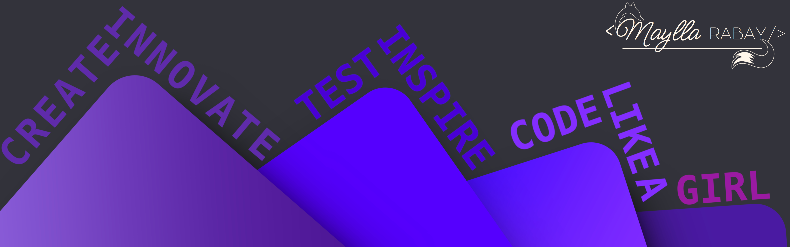

 
 

# Hello World 👋 I'm Maylla Rabay

### Welcome to my Github profile! :octocat:

✔️ Feel free to take a look 
✔️ Contribute with me 
✔️ Or just exchange knowledge 💡 
🚀 We always learn something when we teach 🚀 

 

## Sobre mim 🐉

- 📖 Full Stack Web Developer, graduated from @<a href="https://www.cubos.academy/" target="_blank">Cubos Academy</a> in September 2021 🚀
- 📖 Improving my skills (Discover and NLW) at @<a href="https://rocketseat.com.br/" target="_blank">Rocketseat</a> 🚧 IN DEVELOP 🚀🚧
- 📖 Improving my knowledge every day with hard work and practice 🚧 ALWAYS IN DEVELOP 🚀🚧
- 📖 I participated in the "Code Like a POSSIBLE Girl" project, a mentorship for women developers, sponsored by <a href="https://www.linkedin.com/company/se-candidate-mulher/" target="_blank">Se Candidate, Mulher!</a>, <a href="https://www.linkedin.com/company/elasprogramam/" target="_blank">Elas Programam</a> and <a href="https://www.linkedin.com/company/possible-com/" target="_blank">POSSIBLE</a>.
- 📖 I participated in the "EducaPetBR" project, a mobile application developed in Flutter, for 2 and a half months at <a href="https://espressolabs.com.br/" target="_blank">Espresso Labs</a>.
- 📖 I'm currently working as a Junior Front-end Developer at <a href="https://www.estantemagica.com.br/" target="_blank">Estante Mágica</a>, the biggest reading and writing project in Brazil!
- 💭 I'm addicted to ☕, 💻, 🍫 and 🎼.
- 💭 I love :dog:, playing 🎮, learning new technologies 🧠 and spending time with my 👪.
- 💭 I am a fan of Linux🐧 and love the concept of open source!
- ⚡ Fun fact about me: I can move my ears with the power of my mind 🤯!
- ⚡ My favorite phrases are:

  > "The important thing is to never stop questioning. Curiosity has its own reason for existing." - Albert Einstein

  > "While no one can go back and make a new beginning, anyone can start now and make a new end." - James R. Sherman

 

## 🛠️ I am currently working with ...

 

## 🌱 And learning ...

 

 
 

Made with 💜 by Maylla Rabay

